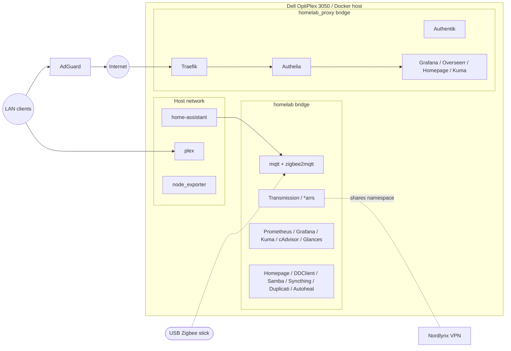

# 🛰️ Home Server on Docker

> Infrastructure-as-code for my Dell OptiPlex 3050 home lab. Every service runs in Docker, networks are segmented, and a single `.env` file keeps secrets out of version control.

## Hardware

**Dell OptiPlex 3050**
- CPU: Intel Core i5-7500T (4 cores @ 2.70GHz)
- RAM: 8GB DDR4
- Storage: 98GB system drive + 5.5TB data drive
- OS: Ubuntu 24.04.3 LTS

## Stack Landscape

All services now live in one `docker-compose.yml`. Logical groupings still help keep things organised:

| Area | Network usage | Why it exists | Key services |
| --- | --- | --- | --- |
| Smart home & Zigbee | Host LAN for discovery, `homelab` for MQTT, `homelab_proxy` for Zigbee UI | Automations, device telemetry, and Zigbee radio access. | `home-assistant`, `mqtt`, `zigbee2mqtt` |
| Media acquisition & library | `homelab` for internal traffic, `homelab_proxy` for UIs, host for Plex | VPN-protected downloads, request management, and playback. | `nordlynx`, `transmission`, `prowlarr`, `sonarr`, `radarr`, `bazarr`, `readarr`, `plex`, `overseerr`, `calibre-web-automated` |
| Monitoring & observability | `homelab` for metrics, `homelab_proxy` for dashboards, host exporters | Metrics, uptime checks, and capacity visibility. | `prometheus`, `grafana`, `loki`, `promtail`, `uptime-kuma`, `cadvisor`, `glances`, `node_exporter` |
| Edge & utilities | `homelab` + `homelab_proxy` | Reverse proxy, SSO, DNS, backups, syncing, and helper tools. | `traefik`, `authelia`, `authentik`, `homepage`, `adguard`, `portainer`, `pgadmin`, `duplicati`, `ddclient`, `samba`, `syncthing`, `flaresolverr`, `autoheal` |

## Repo Layout

```
home-server
├── docker-compose.yml     # consolidated stack definition
├── README.md              # you are here
├── LICENSE
├── config/
│   ├── authelia/          # Authelia policies and user template
│   ├── authentik/         # Authentik persistent configuration & media
│   ├── ddclient/          # Dynamic DNS updater config
│   ├── homeassistant/     # Home Assistant state & automations
│   ├── homepage/          # Dashboard definition
│   ├── loki/              # Loki index & retention settings
│   ├── mosquitto/         # MQTT broker settings
│   ├── promtail/          # Promtail scrape targets and pipelines
│   ├── traefik/           # Reverse proxy configuration & cert dumps
│   └── zigbee2mqtt/       # Zigbee bridge configuration
├── pull-all.sh            # legacy helper (multi-stack version, kept for ref)
├── start-all.sh           # legacy helper (update pending)
├── stop-all.sh            # legacy helper (update pending)
├── update-all.sh          # legacy helper (update pending)
└── weekly-update.sh       # legacy helper (update pending)
```

> Actual secrets live in `.env` **outside** of Git. Keep your own copy synced with the hardware and never commit it.

## Operating the Lab

With everything consolidated you can control the stack directly with Docker Compose:

| Action | Command | Notes |
| --- | --- | --- |
| Boot everything | `docker compose --env-file .env up -d` | Creates the `homelab` network automatically and joins `homelab_proxy` if it already exists. |
| Stop everything | `docker compose --env-file .env down` | Stops containers but preserves volumes. |
| Refresh images | `docker compose --env-file .env pull` | Grab latest images, then rerun `up -d` to apply. |
| Prune unused bits | `docker system prune` | Optional tidy-up after successful upgrades. |

Helper scripts in the repo still reference the old multi-stack layout. Update or remove them once everything in production is using the new root compose file.

### Environment & Secrets

- Maintain a `.env` next to `docker-compose.yml` with UID/GID, timezone, storage paths, VPN keys, Cloudflare token, MQTT credentials, Authelia/Authentik secrets, and Zigbee adaptor path. (Check the compose file for the full list of expected variables.)
- pgAdmin credentials live in `PGADMIN_DEFAULT_EMAIL` and `PGADMIN_DEFAULT_PASSWORD` so the web UI is ready for first sign-in.
- Run Compose commands from the repo root so the relative `config/` mounts resolve correctly.
- Per-service configuration lives under `config/` and is bind-mounted back into containers.

### Networking Notes

- `homelab` is the default bridge shared by most containers. Host networking is used only where broadcast discovery or raw sockets are required (`home-assistant`, `plex`, `node_exporter`).
- `homelab_proxy` carries any HTTP(S) endpoint exposed through Traefik/Authelia. Create it once (`docker network create homelab_proxy`) so services in other compose projects can join.
- NordVPN egress is enforced by `network_mode: service:nordlynx` for Transmission and Prowlarr, keeping traffic inside the tunnel while still exposing their web UIs via published ports on the VPN container.
- Internal DNS (`adguard`) and DHCP let the OptiPlex act as the network edge, while `ddclient` updates the public hostname.

## Network Architecture



### Monitoring & Self-Healing

- Prometheus scrapes `node_exporter` (host metrics) and `cadvisor` (container metrics); Grafana dashboards visualize both.
- Grafana Loki ingests container logs with Promtail tailing the Docker socket, so every service shares a centralised log history.
- `uptime-kuma` keeps an eye on web UIs and external endpoints.
- `autoheal` watches healthchecks and restarts unhealthy containers automatically.

### Storage & Backups

- Media libraries mount from host paths defined in `.env` (`${MEDIA}`, `${MOVIES}`, `${TV}`, `${DOWNLOADS}`, etc.).
- `duplicati` targets `${BACKUP}` for encrypted backups; customize retention and destinations in `config/duplicati`.
- Samba exposes `${DATA}` to Windows clients for simple drag-and-drop access.

### Authelia Logging

- Authelia now defaults to the quieter `info` log level in `config/authelia/configuration.yml`, which is more appropriate for normal operations.
- When deeper troubleshooting is required, create a short-lived override file to bump logging without touching the tracked configuration:

  ```bash
  cat <<'EOF' > authelia-debug.override.yml
  services:
    authelia:
      environment:
        AUTHELIA_LOG_LEVEL: debug
  EOF

  docker compose -f docker-compose.yml -f authelia-debug.override.yml up -d authelia
  ```

  Removing the override file and redeploying (`rm authelia-debug.override.yml && docker compose up -d authelia`) drops Authelia back to the baseline `info` level.
