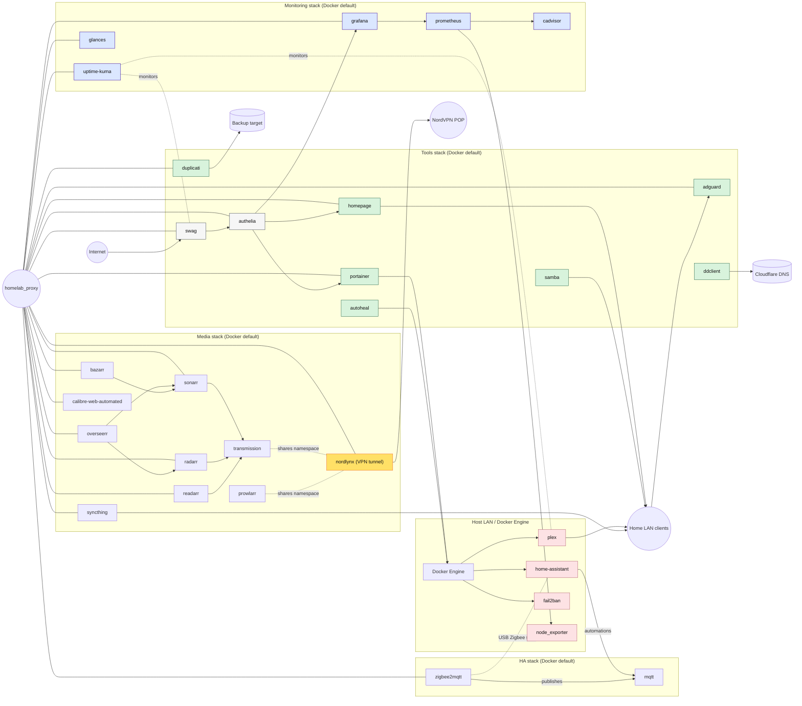

# 🛰️ Home Server on Docker

> Infrastructure-as-code for my Raspberry Pi 4 home lab. Every service runs in Docker, networks are segmented, and a single `.env` file keeps secrets out of version control.

## Stack Landscape

| Stack | Network usage | Why it exists | Key services |
| --- | --- | --- | --- |
| `HA` | Host LAN for discovery + stack default (Docker-managed) | Smart-home automations via Home Assistant with Zigbee over MQTT. | `home-assistant`, `mqtt`, `zigbee2mqtt` |
| `media` | Stack default + `homelab_proxy` for HTTP ingress | Media acquisition, library curation, and streaming with a NordVPN egress. | `nordlynx`, `transmission`, `prowlarr`, `sonarr`, `radarr`, `plex`, `overseerr`, `readarr`, `syncthing`, `calibre` |
| `monitoring` | Stack default + `homelab_proxy` for dashboards | Platform observability and alerting. | `uptime-kuma`, `prometheus`, `grafana`, `cadvisor`, `node_exporter` |
| `tools` | `homelab_proxy` for ingress + host for `fail2ban` | Edge services, SSO, backups, DNS, and portal. | `swag`, `authelia`, `homepage`, `adguard`, `portainer`, `duplicati`, `ddclient`, `samba`, `autoheal`, `fail2ban` |

## Repo Layout

```
home-server
├── .env.example          # template for secrets & tuning (copy to .env locally)
├── README.md             # you are here
├── LICENSE
├── start-all.sh          # spin up every stack
├── stop-all.sh           # stop every stack
├── update-all.sh         # pull + redeploy + prune
├── pull-all.sh           # pull latest images only
├── weekly-update.sh      # cron-friendly update orchestrator
├── HA/
│   ├── docker-compose.yml
│   └── config/           # Home Assistant, Mosquitto, Zigbee2MQTT state
├── media/
│   ├── docker-compose.yml
│   └── config/           # Plex, Overseerr, *arrs, Syncthing, Calibre, etc.
├── monitoring/
│   ├── docker-compose.yml
│   └── config/           # Prometheus rules, Grafana data, Kuma state
└── tools/
    ├── docker-compose.yml
    └── config/           # AdGuard, Authelia, SWAG, Portainer, backups
```

> Actual secrets live in `.env` **outside** of Git. Keep your own copy synced with the hardware and never commit it.

## Operating the Lab

| Action | Command | Notes |
| --- | --- | --- |
| Boot everything | `./start-all.sh` | Reads stack order and references `.env` for shared vars. |
| Stop everything | `./stop-all.sh` | Brings stacks down in reverse order. |
| Refresh images | `./update-all.sh` | Pulls images, redeploys, and prunes dangling layers. |
| Pull only | `./pull-all.sh` | Useful before scheduled maintenance windows. |
| Weekly automation | `./weekly-update.sh` | Wrapper for unattended updates + notifications. |

### Environment & Secrets

- Copy `.env.example` to `.env` on the host and populate credentials (`PUID`, `PGID`, `TZ`, VPN keys, Cloudflare token, etc.).
- All compose files expect the `.env` file to sit next to the scripts, so run commands from the repo root.
- Per-service configuration lives under each stack’s `config/` directory and is bind-mounted back into containers.

### Networking Notes

- `homelab_proxy` is the only shared bridge network. `swag`, `authelia`, and any HTTP services exposed through the reverse proxy join it across stacks. It is created automatically when the `tools` stack starts (or manually via `docker network create homelab_proxy`).
- Each stack otherwise relies on the Docker-managed default network, keeping isolation without hard-coding subnets.
- NordVPN egress is enforced by `network_mode: service:nordlynx` for Transmission and Prowlarr to keep metadata private.
- Host-mode workloads (`home-assistant`, `plex`, `fail2ban`, `node_exporter`) need raw LAN access for device discovery and firewalling.
- Internal DNS (`adguard`) and DHCP let the Pi act as the network edge, while `ddclient` updates the public hostname.

## Network Architecture



### Monitoring & Self-Healing

- Prometheus scrapes `node_exporter` (host metrics) and `cadvisor` (container metrics); Grafana dashboards visualize both.
- `uptime-kuma` keeps an eye on web UIs and external endpoints.
- `autoheal` watches healthchecks and restarts unhealthy containers automatically.

### Storage & Backups

- Media libraries mount from host paths defined in `.env` (`${MEDIA}`, `${MOVIES}`, `${TV}`, `${DOWNLOADS}`, etc.).
- `duplicati` targets `${BACKUP}` for encrypted backups; customize retention and destinations in `config/duplicati`.
- Samba exposes `${DATA}` to Windows clients for simple drag-and-drop access.
